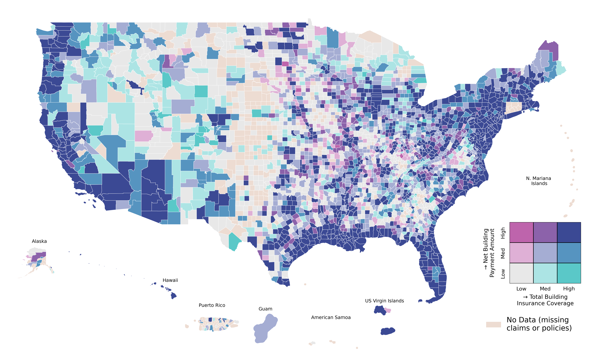

# 🗺️ Flood Insurance Maps

## Visualizing NFIP Flood Insurance Coverage vs. Claim Payments at the U.S. County Level

*Alt text: U.S. county-level map showing a bivariate color scale comparing net building payment amounts (y-dimension) and total building insurance coverage (x-dimension). Darker purples indicate counties with both high coverage and high payments. Lighter colors show lower values or missing data. Insets include Alaska, Hawaii, Puerto Rico, and U.S. territories.*

---
## 🎞️ Animation of the Costliest Flood Events

A dynamic map showing the **Top 10 Costliest Flood Events** in U.S. history based on total NFIP claim payments, **adjusted to 2025 dollars**.

Each frame highlights one event, mapping both:
- **Total claim payments**, and  
- **Insurance coverage**,  
at the county level using a bivariate choropleth.

  
*Alt text: Animated U.S. county maps showing the geographical distribution of NFIP claim payments and insurance coverage for each of the top 10 flood events by adjusted payouts.*

---

## 📊 Datasets Used

- **NFIP Redacted Claims Dataset**:  
  https://www.fema.gov/openfema-data-page/fima-nfip-redacted-claims-v2  
- **NFIP Policies Dataset**:  
  https://www.fema.gov/openfema-data-page/fima-nfip-redacted-policies-v2  
- **U.S. County Geometries**:  
  https://www2.census.gov/geo/tiger/TIGER2024/COUNTY/

## 🗂️ Repository Structure

📁 figures/

└──  coverage_vs_payments_figure.png      Final bivariate choropleth map

└── top_10_flood_events_animated.mp4      Top 10 costliest flood events

📁 scripts/

└── download_from_openFEMA.py           # Downloads NFIP datasets from FEMA

└── plot_bivariate_choropleth.py        # Processes data and creates the map

└── generate_animation_top_10_flood_events.py        # Generate Animation of top 10 costliest flood events

---

## 💡 Inspiration 

This work was inspired by [@Marc's](https://www.linkedin.com/in/markebauer/) [deep dive](https://github.com/mebauer/duckdb-fema-nfip) into  NFIP datasets that got me thinking about how coverage and claims vary spatially.
